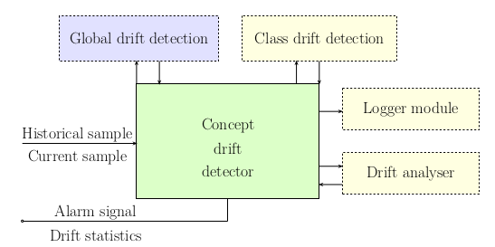

# Drift Analyzer
This tools provides dataset stability analysis that is based on drift detection method Model-based Feature Weight Drift Detection (MFWDD). The dataset stability is evaluated based on worflow used in "experiment_runner.py". The analysis is segmented in these catagories: 
* Global: Full dataset drift detection regardless label column
* Per Class: Per class drift detection (requires fully labeled dataset)
* Per Feature: Impact analysis of specific features to the drift

The output of this tool is a dataset report file used for [Dataset Catalog](https://dataset-catalog.liberouter.org/). Additionally, it provides additional metadata that can be further analysed. An example is available using a Jupyter notebook in the "resources" directory.

# Installation 
Clone this repo and go to the directory
* cd DatasetCatalog-Tools/drift-analysis

Create virtual environemnt
* python3 -m venv venv
* . ./venv/bin/activate 

Run the evaluation
* python3 experiment_runner.py

If everything runs without any issue you are ready for configuration 

## Configuration
Edit mainly experiment_runner.py where specification of experiment parameters can be defined. The main lines that requires modification are commented by "Action" keyword.  

## Details
In this section, we provide more details about the customized drift detection and analysis workflow. In the picture below, you can see the high-level architecture of the Drift Analyzer module.



The following example describes how to use the drift detector to perform one
round of detection to compare two time windows of one dataset to analyse how
it evolves. CESNET-QUIC22 dataset was used as an example, available through
their DataZoo platform, which is used as follows:

```python
from cesnet_datazoo.datasets import CESNET_QUIC22
from cesnet_datazoo.config import DatasetConfig

data = CESNET_QUIC22("../datasets/QUIC/", size="XS")

#Get the first week of data
dataset_config = DatasetConfig(dataset=data, train_period_name="W-2022-44",use_packet_histograms=True)
data.set_dataset_config_and_initialize(dataset_config)
data_ref = data.get_train_df(flatten_ppi=True)

#Get the second week of data
dataset_config = DatasetConfig(dataset=data, train_period_name="W-2022-45",use_packet_histograms=True)
data.set_dataset_config_and_initialize(dataset_config)
data_curr = data.get_train_df(flatten_ppi=True)
```

The process of initialising drift detector is done by supplying it with con-
figuration for the global detection test. Additionaly, one may supply the
configuration for the class-based test or use the Logger or Analyser mod-
ules. Only class-based test is showcased in this example, where one may use
different tests for the different detection modules.

```python
from detector.detector import DriftDetector, Config
from detector.test import KSTest, WassersteinTest

# Define the configuration of the global drift detection
global_config = Config(
    chosen_features = feat_names,
    #Optional parameter for the final weighning of the individual feature tests
    feature_importances = pd.Series(clf.feature_importances_,index = clf.feature_names_in_),
    drift_test=WassersteinTest()
)

# Define the configuration of the class -based drift detection
class_config = Config(
    chosen_features = feat_names,
    feature_importances = pd.Series(clf.feature_importances_,index = clf.feature_names_in_),
    drift_test=KSTest(),
    class_name="APP"
)

detector = DriftDetector(global_config, class_config)
```

The single round of drift detection is run as follows:

```python
detector.detect(data_ref,data_curr)
```

Each global statistic measured for the current round of detection can be returned in the following way. If one used the Analyser module, the inferred drift type would also be returned. This represents the same statistics that would be stored by the Logger module.

```python
detector.get_drift_statistics()
```

Even if no drift was discovered, some of the features could still be detected as drifted in their individual tests. They may be returned by calling:

```python
detector.get_drifted_features()
```

The class-based tests are run separately and their result may be obtained in this way. This presumes we have a way of obtaining the ground truth class labels, so it is intended to be used when analysing captured datasets. 

```python
detector.get_class_drift()
```
